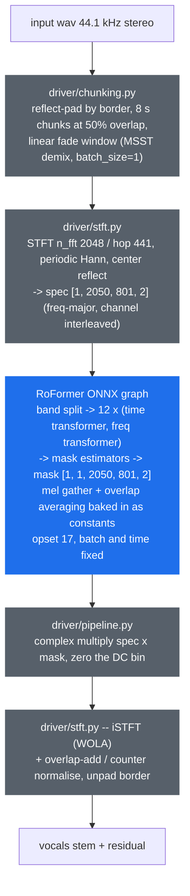

# port-bs-roformer-onnx

**ONNX/DirectML port of BS-RoFormer and Mel-Band RoFormer — state-of-the-art music source separation on *any* DX12 GPU (AMD, Intel, NVIDIA), no CUDA, no torch at inference time.**

[](LICENSE)
[](#status)
[](https://onnxruntime.ai/docs/execution-providers/DirectML-ExecutionProvider.html)
[](toolkit/setup-env.ps1)

## Why this exists

[BS-RoFormer and Mel-Band RoFormer](https://github.com/ZFTurbo/Music-Source-Separation-Training)
are the current state of the art in music source separation — roughly **+0.8 dB SDR on vocals
over MDX23C** on ZFTurbo's own multisong benchmark, and further ahead on hard material. Like
the rest of that ecosystem they ship as PyTorch `.ckpt` files: running one means carrying a
full torch install, and GPU acceleration means CUDA.

**This project exports them to plain ONNX graphs and reimplements the whole pre/post chain in
numpy** — STFT, complex mask multiply, DC filter, iSTFT and the overlapping-chunk overlap-add —
so inference runs through [onnxruntime](https://onnxruntime.ai/) on any execution provider
(DirectML on any DX12 GPU, CUDA, CPU) with **zero torch and zero librosa at runtime**.

The golden reference for every number below is
[ZFTurbo/Music-Source-Separation-Training](https://github.com/ZFTurbo/Music-Source-Separation-Training)
(MIT) itself, pinned at commit `e247dfe`, run unpatched through its own `demix` path.

## Models

| Model | Arch | Stems | Weights by | Weights licence | Published here |
|---|---|---|---|---|---|
| `mel_band_roformer_kim` | Mel-Band RoFormer | vocals / other | [KimberleyJensen](https://huggingface.co/KimberleyJSN/melbandroformer) | **MIT** (declared on the model card) | **yes** |
| `bs_roformer_viperx_1297` | BS-RoFormer | vocals / other | viperx | **none stated** | no — export it yourself |

**On licensing, which decided which model got ported.** Kim's Mel-Band RoFormer is the
highest-scoring roformer vocal checkpoint that carries an explicit permissive licence
(SDR vocals **10.98** on MSST's multisong benchmark). The better-known viperx BS-RoFormer
(`model_bs_roformer_ep_317_sdr_12.9755`, SDR 10.87) is hosted on
[TRvlvr/model_repo](https://github.com/TRvlvr/model_repo), a repository with **no LICENSE file
and an eleven-byte README**; no one has granted redistribution rights for those weights, so its
ONNX graph is **not** in the release. The toolkit exports it in one command if you have the
checkpoint. Same rule for anything else you point the toolkit at — see
[`toolkit/catalog.py`](toolkit/catalog.py), where `redistributable` is a per-model field.

Other notable checkpoint families and what they declare, for anyone extending the catalog:
[anvuew](https://huggingface.co/anvuew) is **GPL-3.0** (dereverb, karaoke);
[Sucial](https://huggingface.co/Sucial) and becruily's `deux` are **CC-BY-NC(-SA)**
(non-commercial); **unwa/pcunwa** and **gabox** — the highest-SDR community models — declare
**nothing at all**: no licence, no model card, no training-data statement.

## How it works

The graph is only the middle of the pipeline. ONNX has no complex dtype and no `istft`, so the
transform ends are amputated and reimplemented in numpy — the same cut ZFTurbo makes in
[MSS_ONNX_TensorRT](https://github.com/ZFTurbo/MSS_ONNX_TensorRT)'s `models_without_stft`.



**Three export-neutral changes** are applied to the upstream module before tracing
([`toolkit/spec_models.py`](toolkit/spec_models.py)); none touches a weight:

1. **STFT/iSTFT amputated** — the graph runs spec-in / mask-out.
2. **`Attend.flash = False`** — attention traces as explicit einsum + softmax instead of
   `scaled_dot_product_attention`. Same math, and the module has no parameters.
3. **`nn.GLU` replaced by an equivalent slice** — see below. This one is not cosmetic.

### The DirectML GLU bug

The first working export produced **garbage on DirectML while being correct on the CPU EP**:
output correlated 0.94 with the reference but rescaled, and its minimum sat at exactly
**-0.2785** — which is `min(x·sigmoid(x))`, the fingerprint of a GLU whose two halves collapsed
into one. Isolated with micro-graphs:

| pattern | CPU EP | DirectML EP |
|---|---|---|
| `Split(2) -> Sigmoid(out1) -> Mul(out0, ·)` — what `F.glu` exports as | OK | **wrong** |
| same, with `axis` written positively instead of `-1` | OK | **wrong** |
| `Mul(Sigmoid(out0), out1)` — operands swapped | OK | OK |
| `Add(out0, Sigmoid(out1))` | OK | OK |
| 4-way split, two GLUs summed | OK | OK |
| 62-way split + concat (the band split) | OK | OK |
| `Slice/Slice -> Sigmoid -> Mul` — the replacement used here | OK | OK |

Disabling ORT graph optimisation (`ORT_DISABLE_ALL`) changes nothing, so this is not an ORT
fusion — it is inside the DirectML EP. Replacing `nn.GLU` with two `Slice`s took the DirectML
parity from `max 5.76` to `max 6.7e-06`. Environment: `onnxruntime-directml 1.24.4`,
Radeon RX 7800 XT, Windows 11.

## Status

**Artifacts**: published as GitHub release
[`models-v1.0`](https://github.com/santiquiroz/port-bs-roformer-onnx/releases/tag/models-v1.0) —
`mel_band_roformer_kim_T801.onnx` (931 MB fp32, opset 17, sha256 `1b8afd77…f625a`) plus
`manifest.json` recording the source checkpoint SHA-256, the graph SHA-256, the export patches
applied, the weights licence and the measured parity. Or build it yourself in three commands
(below) — the export refuses to run on a checkpoint hash mismatch, so a local build is
verifiable against the same manifest.

All numbers measured on Ryzen + Radeon RX 7800 XT (DirectML), against golden dumps produced by
**unpatched** upstream MSST torch on the committed synthetic fixture
(`refs/inputs/fixture_mix.wav`, 12 s stereo 44.1 kHz, generated from a fixed seed by
`toolkit/make_fixture.py`).

### Parity (`toolkit/validate_ort.py`)

Gates: `mask` p99.9 < 1e-4 **and** RMS < 1e-5; `synth` SI-SDR > 100 dB; `quality` no more
than 0.5 dB below the reference. `stft` and `drift` are printed, not gated.

| stage | what it compares | CPU EP | DirectML |
|---|---|---|---|
| `stft` | driver numpy STFT vs `torch.stft` (chunk 0, spec peaks at 161) | max 1.54e-05, rms 5.3e-07, p99.9 4.6e-06 | same (no EP involved) |
| `mask` | graph fed the **golden** spectrum vs golden mask | max 2.37e-05, rms 2.0e-07, p99.9 2.4e-06 **OK** | max 2.92e-05, rms 1.7e-07, p99.9 2.1e-06 **OK** |
| `synth` | driver tail (complex mult + DC + iSTFT) on golden spec+mask | 138.4 dB **OK** | 138.4 dB **OK** |
| `quality` | separation quality vs the fixture's ground-truth vocal | reference 0.71 dB, driver 1.00 dB, **+0.29 dB OK** | reference 0.71 dB, driver 1.00 dB, **+0.29 dB OK** |
| `drift` | driver stems vs one specific reference run | 26.6 dB (informational — see below) | 26.6 dB (informational) |

Net-level export parity (`toolkit/export_roformer.py`, random spectra, torch vs ORT CPU-EP,
gate 1e-4): **max 1.40e-06**.

The `quality` row moving *up* 0.29 dB is expected, not luck: the driver's STFT is computed in
float64 and the reference's in float32.

### Throughput (`toolkit/bench_dml.py`)

One graph call = one 8.00 s chunk (`spec [1, 2050, 801, 2]`). e2e = `RoformerDriver.separate()`
on the 12 s fixture, which is 5 chunks because of the 50% overlap plus the reflect-padded border.
6 timed runs after 2 warmups; RX 7800 XT, `onnxruntime-directml` 1.24.4.

| EP | ms / chunk (best) | median | chunk realtime | e2e, 12 s fixture |
|---|---|---|---|---|
| CPU | 11667.7 | 12095.0 | 0.69x | 63.88 s (0.19x) |
| DirectML | **1852.2** | 1926.3 | **4.32x** | **10.14 s (1.18x)** |

DirectML is **6.3x** the CPU EP here. The numpy pre/post chain is not the bottleneck: at
5 chunks x 1.85 s the graph accounts for ~9.3 s of the 10.14 s e2e, so this is the network,
not the driver.

For scale: an MDX-Net ONNX graph on this same card measures ~38x realtime (0.153 s per 5.78 s
chunk, measured separately, not in this repo). This model therefore costs roughly **9x more per
second of audio** — that is the price of the accuracy, and it is the number to weigh before
making it a default anywhere.

### The honest caveat: this architecture is chaotic at float32 resolution

`drift` above — the sample-level agreement between this port's output and one specific torch
reference run — is **26.6 dB SI-SDR, and it is not a gate**, because no reimplementation can do
better. The evidence, measured with **no ONNX anywhere in the loop**:

| what | mask max-abs difference |
|---|---|
| upstream torch model, fed a float64-accurate STFT instead of its own float32 one (inputs differ by **1.5e-05** on a spectrum peaking at 161) | **0.2656** |
| the exported ONNX graph vs upstream torch, both fed the **same** spectrum | **1.7e-05** |
| the exported graph, fed the golden spectrum plus gaussian noise of 5e-07 | 2.5e-02 |
| the exported graph, run twice on the same input (DirectML) | exactly 0 |

So a difference of one float32 ulp in the input spectrogram moves the mask by ~0.27, while the
port itself is faithful to 1.7e-05. Sample-level reproduction of a particular reference run is
therefore unattainable, and the meaningful question is whether the port **separates as well as
the reference** — which is what the gated `quality` row measures, scoring both against the
fixture's ground-truth stem.

Two consequences worth knowing before integrating:

- Do not write a regression test that compares audio bytes against a stored reference produced
  by a different STFT implementation. Compare graph output for a fixed spectrum instead.
- The fixture is built for *parity*, not for judging separation quality: it is synthetic, and
  both the reference and this port score only ~1 dB SI-SDR on it. Judge quality on real music.

## Usage

### Toolkit setup

```powershell
pwsh -File toolkit/setup-env.ps1     # .venv (py3.11, torch CPU, ort-directml) + pinned MSST checkout
```

Then drop a checkpoint into `checkpoints/` (the URL and expected SHA-256 for each model live in
[`toolkit/catalog.py`](toolkit/catalog.py); the export refuses to run on a hash mismatch):

```powershell
curl -L -o checkpoints/MelBandRoformer.ckpt `
  https://huggingface.co/KimberleyJSN/melbandroformer/resolve/main/MelBandRoformer.ckpt
```

```powershell
.venv/Scripts/python.exe toolkit/make_fixture.py                        # regenerate the fixture
.venv/Scripts/python.exe toolkit/capture_baseline.py mel_band_roformer_kim   # golden dumps (torch)
.venv/Scripts/python.exe toolkit/export_roformer.py mel_band_roformer_kim    # ONNX + manifest
.venv/Scripts/python.exe toolkit/validate_ort.py  mel_band_roformer_kim      # gates, CPU + DML
.venv/Scripts/python.exe toolkit/bench_dml.py     mel_band_roformer_kim      # throughput
.venv/Scripts/python.exe -m pytest tests -q                                  # driver unit tests
```

Exporting at a shorter chunk (lower VRAM, lower quality) is `--chunk 176400`. The time axis is
fixed at trace time: the rotary embedding bakes its frequency table per sequence length, so a
dynamic time axis is not available.

### Using the driver standalone

`driver/` imports numpy and nothing else — no torch, no librosa, not even onnxruntime (the
caller owns the session). A test enforces that. Vendor it as-is, together with a
[`models-v1.0`](https://github.com/santiquiroz/port-bs-roformer-onnx/releases/tag/models-v1.0)
graph:

```python
import numpy as np
import onnxruntime as ort
import soundfile as sf

from driver.pipeline import RoformerDriver, RoformerSpec

sess = ort.InferenceSession(
    "mel_band_roformer_kim_T801.onnx",
    providers=[("DmlExecutionProvider", {"device_id": 0}), "CPUExecutionProvider"],
)
driver = RoformerDriver(lambda spec: sess.run(None, {"spec": spec})[0], RoformerSpec())

mix, sr = sf.read("input.wav", dtype="float32")     # 44.1 kHz; driver expects [2, N]
stems = driver.separate(mix.T)                       # [num_stems, 2, N]
sf.write("vocals.wav", stems[0].T, sr)
sf.write("instrumental.wav", (mix.T - stems[0]).T, sr)
```

Input must be 44.1 kHz (resample first). Mono is duplicated to stereo. `RoformerSpec` defaults
match the shipped graph; for another export read `n_fft`, `hop_length`, `chunk_size` and
`num_overlap` out of `manifest.json`.

## Integration notes

Same shape as [port-gmfss-onnx](https://github.com/santiquiroz/port-gmfss-onnx),
[port-audiosr-onnx](https://github.com/santiquiroz/port-audiosr-onnx) and
[port-uvr-deecho-onnx](https://github.com/santiquiroz/port-uvr-deecho-onnx): `driver/` is
self-contained and designed to be vendored, and session caching, chunk-level cancellation and
progress reporting are deliberately out of scope — `RoformerDriver.separate` takes an
`on_chunk(done, total)` callback and that is the whole hook. A caller needs to resample to
44.1 kHz, hand it a `[2, N]` float32 array, and own its own device policy.

Two things that will matter to an integrator:

- **The graph is ~931 MB fp32** and holds a ~1.3 GB attention intermediate at T=801. Budget
  VRAM accordingly, or export at a shorter chunk.
- **Stems are `num_stems` outputs, not a primary/secondary pair.** These checkpoints predict
  one stem (`vocals`); the instrumental is `mix - vocals`, with no compensation factor — unlike
  MDX-Net, which needs one.

## Credits & licence

- **Code in this repo**: MIT (see [LICENSE](LICENSE)).
- **Architecture and golden reference**:
  [ZFTurbo/Music-Source-Separation-Training](https://github.com/ZFTurbo/Music-Source-Separation-Training)
  (MIT, Roman Solovyev), pinned at `e247dfe`. It is cloned by `setup-env.ps1` rather than
  vendored, so the reference and the exported graph can never drift apart. The RoFormer
  architecture itself is by [lucidrains](https://github.com/lucidrains/BS-RoFormer) (MIT),
  after Lu et al., *Music Source Separation with Band-Split RoFormer*.
- **The spec-in/mask-out cut** follows [ZFTurbo/MSS_ONNX_TensorRT](https://github.com/ZFTurbo/MSS_ONNX_TensorRT) (MIT).
- **Model weights**: `mel_band_roformer_kim` is by
  [KimberleyJensen](https://huggingface.co/KimberleyJSN/melbandroformer), MIT. The ONNX graph in
  the release is a mechanical format conversion of those weights; all credit for the model
  belongs to its author. No weights without a stated licence are redistributed here.
